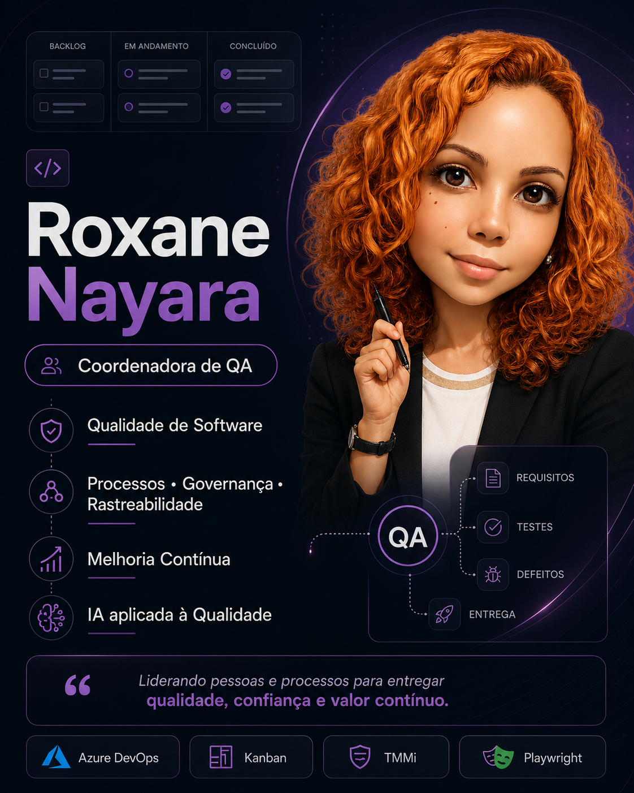

  

# Olá, eu sou Roxane Nayara 👋

Coordenadora de QA com foco em processos, governança, rastreabilidade, melhoria contínua e IA aplicada à Qualidade de Software.

## Sobre mim
- Coordenação e evolução de times de QA
- Estruturação de processos de qualidade
- Governança e rastreabilidade no Azure DevOps
- Gestão de fluxo com práticas Kanban
- Maturidade de testes com referência em TMMi
- IA aplicada à Qualidade de Software

## Projetos em destaque
- [Portfólio profissional de QA](https://github.com/RoxaneNayara/portfolio-qa-process-improvement)
- [Site profissional](https://roxanenayara.github.io/)
- [LinkedIn](https://www.linkedin.com/in/roxanenayara)

## Tecnologias e referências
Azure DevOps • Kanban • TMMi • Playwright • C# • Testes Web • Testes API • Rastreabilidade • Métricas de fluxo • IA aplicada à QA
