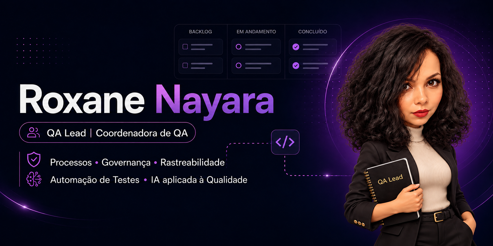

  

## Olá! 👋

Sou **QA Lead e Coordenadora de QA**, com atuação em liderança de times, estruturação de processos, governança, rastreabilidade, melhoria contínua e IA aplicada à Qualidade de Software.

## Sobre mim
- Coordenação e evolução de times de QA
- Estruturação de processos de Qualidade de Software
- Governança e rastreabilidade no Azure DevOps
- Gestão de fluxo com práticas Kanban
- Maturidade de testes com referência em TMMi
- IA aplicada à Qualidade de Software

## Projetos em destaque

- [Portfólio profissional de QA](https://github.com/RoxaneNayara/portfolio-qa-process-improvement)
- [Playwright Automation Lab](https://github.com/RoxaneNayara/playwright-automation-lab)
- [Site profissional](https://roxanenayara.github.io/)

## Conecte-se comigo
 
- [LinkedIn](https://www.linkedin.com/in/roxanenayara)

## Tecnologias e referências

**Gestão e processos:** Azure DevOps, Kanban, TMMi e métricas de fluxo  
**Qualidade e testes:** testes Web, API, acessibilidade, rastreabilidade e Playwright  
**Automação e tecnologia:** TypeScript, C#, GitHub Actions e IA aplicada à Qualidade de Software

---

Transformando desafios de qualidade em processos mais claros, rastreáveis e sustentáveis.
